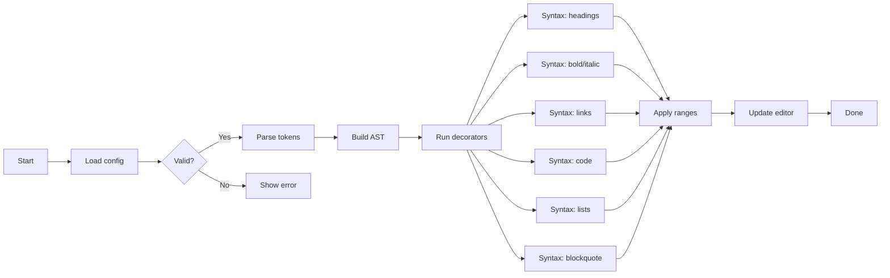
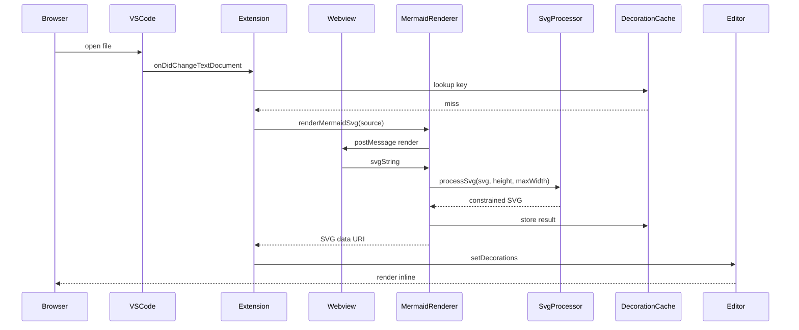
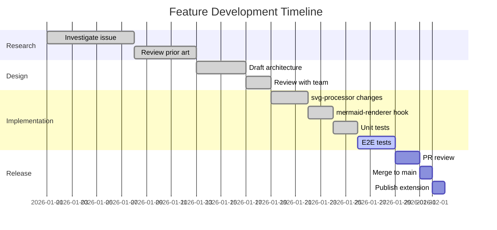
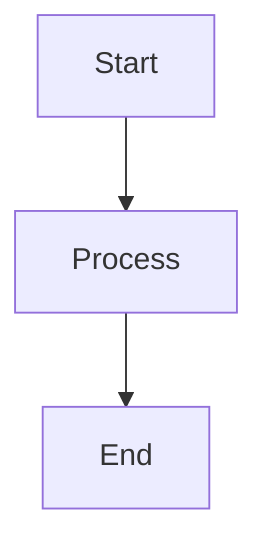
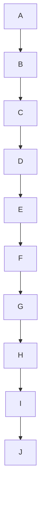

# Mermaid Width Constraint — Manual Test File (Issue #50)

Open this file with the **Markdown Inline Editor** extension active.
Each diagram below should render **within the editor viewport** — no horizontal overflow.

---

## 1. Large flowchart (many nodes)

This is the primary case from the bug report. The diagram is intrinsically wide but must be capped to the editor width.

---

## 2. Wide sequence diagram (many participants)

---

## 3. Gantt chart (wide timeline)

---

## 4. Normal-width diagram (must NOT be clipped)

This diagram is naturally narrow and should render at its intrinsic width without any scaling.

---

## 5. Square / tall diagram (aspect ratio preserved)

---

## Expected results

| # | Diagram | Expected |
|---|---------|----------|
| 1 | Large flowchart | Fits viewport, height scaled proportionally |
| 2 | Wide sequence | Fits viewport, height scaled proportionally |
| 3 | Gantt chart | Fits viewport, height scaled proportionally |
| 4 | Narrow flowchart | Renders at natural width — no clipping |
| 5 | Tall flowchart | Renders at natural width — no clipping |
