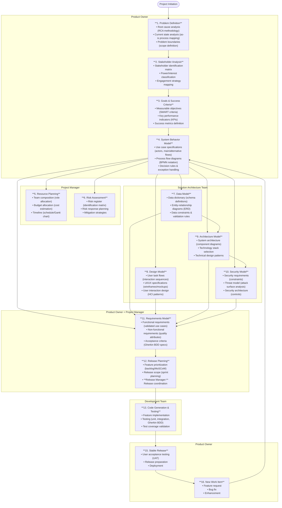

```mermaid
flowchart TD
    %% Initial Project Release Flow
    Start([Project Initiation])
    
    subgraph PO1["Product Owner"]
        Problem["**1. Problem Definition**<br/>• Root cause analysis (RCA methodology)<br/>• Current state analysis (as-is process mapping)<br/>• Problem boundaries (scope definition)"]
        Stakeholder["**2. Stakeholder Analysis**<br/>• Stakeholder identification matrix<br/>• Power/interest classification<br/>• Engagement strategy mapping"]
        Goals["**3. Goals & Success Criteria**<br/>• Measurable objectives (SMART criteria)<br/>• Key performance indicators (KPIs)<br/>• Success metrics definition"]
        Behavior["**4. System Behavior Model**<br/>• Use case specifications (actors, main/alternative flows)<br/>• Process flow diagrams (BPMN notation)<br/>• Decision rules & exception handling"]
    end
    
    subgraph PO2["Product Owner"]
        StableRelease["**15. Stable Release**<br/>• User acceptance testing (UAT)<br/>• Release preparation<br/>• Deployment"]
        WorkItem["**16. New Work Item**<br/>• Feature request<br/>• Bug fix<br/>• Enhancement"]
    end
    
    subgraph POPM["Product Owner + Project Manager"]
        RequirementsComplete["**11. Requirements Model**<br/>• Functional requirements (validated use cases)<br/>• Non-functional requirements (quality attributes)<br/>• Acceptance criteria (Gherkin BDD specs)"]
        ReleasePlan["**12. Release Planning**<br/>• Feature prioritization (backlog/MoSCoW)<br/>• Release scope (sprint planning)<br/>• **Release Manager:** Release coordination"]
    end
    
    subgraph PM["Project Manager"]
        Resources["**5. Resource Planning**<br/>• Team composition (role allocation)<br/>• Budget allocation (cost estimation)<br/>• Timeline (schedule/Gantt chart)"]
        Risks["**6. Risk Assessment**<br/>• Risk register (identification matrix)<br/>• Risk response planning<br/>• Mitigation strategies"]
    end
    
    subgraph SA["Solution Architecture Team"]
        Data["**7. Data Model**<br/>• Data dictionary (schema definitions)<br/>• Entity-relationship diagrams (ERD)<br/>• Data constraints & validation rules"]
        Design["**8. Design Model**<br/>• User task flows (interaction sequences)<br/>• UI/UX specifications (wireframes/mockups)<br/>• User interaction design (HCI patterns)"]
        Architecture["**9. Architecture Model**<br/>• System architecture (component diagrams)<br/>• Technology stack selection<br/>• Technical design patterns"]
        Security["**10. Security Model**<br/>• Security requirements (constraints)<br/>• Threat model (attack surface analysis)<br/>• Security architecture (controls)"]
    end
    
    subgraph Dev["Development Team"]
        CodeGen["**13. Code Generation & Testing**<br/>• Feature implementation<br/>• Testing (unit, integration, Gherkin BDD)<br/>• Test coverage validation"]
    end
    
    %% Flow connections
    Start --> Problem
    Problem --> Stakeholder
    Stakeholder --> Goals
    Goals --> Behavior
    
    %% Parallel Planning Activities
    Behavior --> Resources
    Behavior --> Risks
    
    %% Parallel Design Activities
    Behavior --> Data
    Behavior --> Design
    Behavior --> Architecture
    Behavior --> Security
    
    %% Dependencies
    Data --> Architecture
    Architecture --> Security
    
    %% Requirements Consolidation
    Behavior --> RequirementsComplete
    Data --> RequirementsComplete
    Design --> RequirementsComplete
    Architecture --> RequirementsComplete
    Security --> RequirementsComplete
    
    %% Release Execution
    RequirementsComplete --> ReleasePlan
    ReleasePlan --> CodeGen
    CodeGen --> StableRelease
    
    %% Subsequent Release Flow
    StableRelease --> WorkItem
    WorkItem --> Behavior
```
