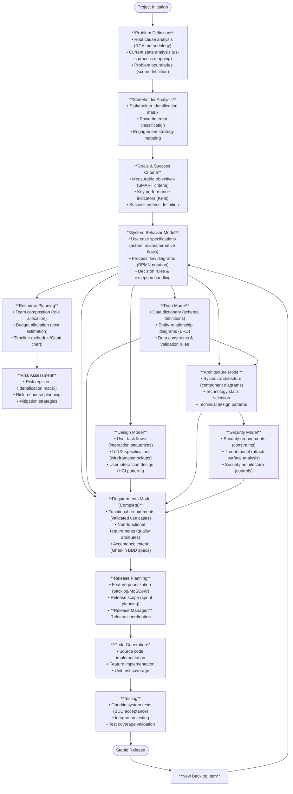

```mermaid
flowchart TD
    %% Initial Project Release Flow
    Start([Project Initiation]) --> Problem["**Problem Definition**<br/>• Root cause analysis (RCA methodology)<br/>• Current state analysis (as-is process mapping)<br/>• Problem boundaries (scope definition)"]
    Problem --> Stakeholder["**Stakeholder Analysis**<br/>• Stakeholder identification matrix<br/>• Power/interest classification<br/>• Engagement strategy mapping"]
    Stakeholder --> Goals["**Goals & Success Criteria**<br/>• Measurable objectives (SMART criteria)<br/>• Key performance indicators (KPIs)<br/>• Success metrics definition"]
    Goals --> Behavior["**System Behavior Model**<br/>• Use case specifications (actors, main/alternative flows)<br/>• Process flow diagrams (BPMN notation)<br/>• Decision rules & exception handling"]
    Behavior --> Resources["**Resource Planning**<br/>• Team composition (role allocation)<br/>• Budget allocation (cost estimation)<br/>• Timeline (schedule/Gantt chart)"]
    Resources --> Risks["**Risk Assessment**<br/>• Risk register (identification matrix)<br/>• Risk response planning<br/>• Mitigation strategies"]
    Behavior --> Data["**Data Model**<br/>• Data dictionary (schema definitions)<br/>• Entity-relationship diagrams (ERD)<br/>• Data constraints & validation rules"]
    Behavior --> Design["**Design Model**<br/>• User task flows (interaction sequences)<br/>• UI/UX specifications (wireframes/mockups)<br/>• User interaction design (HCI patterns)"]
    Behavior --> Architecture["**Architecture Model**<br/>• System architecture (component diagrams)<br/>• Technology stack selection<br/>• Technical design patterns"]
    Data --> Architecture
    Architecture --> Security["**Security Model**<br/>• Security requirements (constraints)<br/>• Threat model (attack surface analysis)<br/>• Security architecture (controls)"]
    Behavior --> RequirementsComplete["**Requirements Model (Complete)**<br/>• Functional requirements (validated use cases)<br/>• Non-functional requirements (quality attributes)<br/>• Acceptance criteria (Gherkin BDD specs)"]
    Data --> RequirementsComplete
    Design --> RequirementsComplete
    Architecture --> RequirementsComplete
    Security --> RequirementsComplete
    RequirementsComplete --> ReleasePlan["**Release Planning**<br/>• Feature prioritization (backlog/MoSCoW)<br/>• Release scope (sprint planning)<br/>• **Release Manager:** Release coordination"]
    ReleasePlan --> CodeGen["**Code Generation**<br/>• Source code implementation<br/>• Feature implementation<br/>• Unit test coverage"]
    CodeGen --> Testing["**Testing**<br/>• Gherkin system tests (BDD acceptance)<br/>• Integration testing<br/>• Test coverage validation"]
    Testing --> StableRelease([Stable Release])
    
    %% Subsequent Release Flow
    StableRelease --> BacklogItem["**New Backlog Item**"]
    BacklogItem --> Behavior
```
